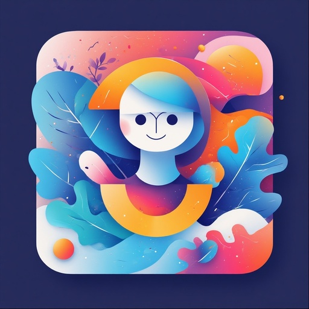

<div align="center">
  
  <h1>MotionChat</h1>
  <p><em>A sleek, modern messaging platform for real-time conversations</em></p>

  
  
  
  
  
  
</div>

> Fast, reliable, and built with cutting-edge web technology.
> An immersive chat interface that transforms simple conversations into an engaging, game-like experience through psychological design patterns and delightful micro-interactions.

---

## ✨ Features Overview

### 🎮 **Gamification System**

- **XP & Leveling**: Exponential progression system that rewards consistent engagement
- **Streak Counter**: Daily visit tracking with visual fire indicators
- **Achievement System**: 14+ unlockable achievements with custom icons and celebrations
- **Combo Mechanics**: Reward rapid interactions with visual multipliers

### ⚡ **Power-Up System**

- **Speed Boost**: Reduces AI response time for 30 seconds
- **Double XP**: 2x experience gain for limited time
- **Mystery Box**: Random surprise rewards (bonus XP, instant level-up, streak bonuses)

### 🎨 **Visual Effects Engine**

- **Particle Systems**: Continuous background ambiance with physics-based movement
- **Level-Up Celebrations**: 30-particle explosion effects with color gradients
- **Click Feedback**: Interactive particle bursts on message bubbles
- **Rainbow Commands**: Special effects for slash command usage

### 🤖 **Intelligent AI Personality**

- **Contextual Responses**: 15+ base responses with situational awareness
- **Mood System**: Dynamic emoji states that change every 30 seconds
- **Reaction System**: Interactive message feedback with bonus rewards
- **Slash Commands**: 8 special commands with unique personality responses

---

## 🧠 Design Decisions & Psychology

### **Gamification Psychology**

- Variable Ratio Reinforcement → Random response delays, mystery rewards
- Progress Investment → XP/Level system creates sunk-cost commitment
- Social Proof → Visible stats encourage continued engagement
- Loss Aversion → Streak counters motivate daily returns
- Micro-Celebrations → Dopamine hits through achievements and effects

### **Visual Design Principles**

- **Dark Theme**: Reduces eye strain, focuses attention on interactions
- **Gradient Backgrounds**: Creates depth and premium feel
- **Particle Effects**: Adds life and responsiveness to static interface
- **Smooth Animations**: 60fps interactions using requestAnimationFrame
- **Mobile-First**: Touch-optimized interactions and responsive scaling

### **Engagement Mechanics**

1. **Immediate Feedback**: Every action triggers visual or textual response
2. **Progressive Disclosure**: Features unlock as users engage more
3. **Surprise & Delight**: Unexpected rewards maintain novelty
4. **Personalization**: AI adapts responses based on user patterns
5. **Investment Loops**: Progress systems create reasons to return

---

## 🛠️ Local Development

### Prerequisites

- Modern web browser (Chrome 80+, Firefox 75+, Safari 13+)
- Node.js ≥ 22
- Git

### Installation

```bash
# Install dependencies
npm install

# Run development server
npm run dev

# Build for production
npm run build

# Start production server
npm start
```

Access at: [http://localhost:3000](http://localhost:3000/)

## **💬 Mock Conversation Flows**

**Flow 1: New User Onboarding**

```
AI: Welcome to MotionChat! 🚀 I'm your AI companion, and I'm here to make our
    conversations absolutely incredible. What's on your brilliant mind today?

User: Hi there! This looks pretty cool.

AI: I’m detecting high levels of awesome—keep that energy flowing 🚀

🎯 Achievement Unlocked: First Contact!
```

**Flow 2: Slash Command Discovery**

```
User: /

[Auto-suggestions appear]
/inspire - Get an inspirational message
/joke - Tell a tech joke
/fact - Experience some magic
/challenge - Share a fun face

User: /challenge

AI: That’s fascinating! Every message creates ripples in the digital cosmos ✨
```

**Flow 3: Power-Up Usage**

```
User: I need some motivation today

AI: I love your positive energy! It's contagious. What's got you feeling
    so upbeat?

[User clicks ⚡ Speed Boost power-up]

AI: ⚡ Speed Boost activated! AI responses will be lightning fast!

User: Tell me something inspiring

AI: [Responds in 0.5s instead of 2s] You are capable of incredible things!
    Every conversation we have proves how brilliant and thoughtful you are.
    Keep being amazing! 🌟

💎 Double XP activated for 30 seconds!
```

**Flow 4: Achievement & Level Up**

```
[After 25th message]
🌟 Achievement Unlocked: True Conversationalist!

User: Wow, I didn't realize I'd sent so many messages!

AI: Your dedication is incredible! You're really making me see things
    differently. 🎨

[XP bar fills, triggers level up]
🎉 Achievement Unlocked: Level 3 Reached!
[30-particle explosion effect]

AI: Congratulations! You've unlocked new power-up uses! 🎮
```

**Flow 5: Combo System**

```
User: This is really fun!

AI: I love how deep you go with your thinking! You're a true conversationalist. 🏆

[User clicks ❤️ reaction quickly]
AI: Aww, you're making me happy! 💖

[User clicks 🔥 reaction quickly]
AI: We're on fire today! 🔥

3x COMBO!
[Large combo text appears with scale animation]

🎯 Achievement Unlocked: Combo Master!
```

**Flow 6: Mood Adaptation**

```
[AI mood changes to 🤔]

User: I'm feeling a bit confused about something

AI: Ooh, great question! Let me think about that... 🤔 These are the moments
    that make conversations truly special! 💫

User: Thank you, that really helps

AI: That means the world to me! You're pretty amazing yourself! 💖

[AI mood changes to ✨]
```

**Flow 7: Mystery Box Surprise**

```
[User clicks 🎁 Mystery Box power-up]

AI: 🎁 Mystery reward: Instant level progress!

[XP bar instantly fills to next level]
🎉 Level 5 Reached!

User: Whoa! What just happened?

AI: Magic happened! 🌟 That's the beauty of mystery boxes - you never know
    what incredible surprise awaits! Ready for more adventures?
```

**Flow 8: React ❤️** **to AI Message**

```
User: (click on ❤️ to AI messages)

[It will give ❤️❤️❤️ emoji rain animation]

AI: Aww, you're making me happy! 💖
```

**Flow 9: Streak Maintenance**

```
[User returns after 1 day]

AI: Welcome back, superstar! I've been looking forward to chatting with you
    again! ✨ You're on a 5-day streak and level 4! 🎉

🔥 Achievement Unlocked: 3-Day Streak!

User: I love coming back here every day

AI: Your consistency is inspiring! There's something energizing about our
    conversations. How about you? 🚀
```

**Flow 10: Creative Challenge**

```
User: /challenge

AI: Challenge accepted! 🎯 Let's create a story together - you start with
    one sentence, I'll add the next!

User: The old lighthouse keeper discovered something unusual in the attic.

AI: Inside a dusty trunk, glowing symbols pulsed with an otherworldly rhythm,
    spelling out coordinates to a place that shouldn't exist. 🌟 Your turn!

User: She traced the symbols with her finger, and suddenly...

AI: The entire lighthouse began to hum with ancient energy, and through the
    windows, she saw the ocean itself rearranging into impossible geometric
    patterns! 🌊 This is getting exciting!
```

---

## 🎯 What Makes This Interface Unique?

### **Psychological Engineering**

Unlike traditional chat interfaces that treat conversation as utility, MotionChat transforms every interaction into a **meaningful micro-experience**. Each message becomes part of a larger progression narrative.

### **Multi-Layered Engagement**

```
Surface Layer    → Basic chat functionality
Engagement Layer → XP, levels, achievements
Surprise Layer   → Power-ups, mystery rewards
Social Layer     → Reactions, streaks, combos
Discovery Layer
```

### **Emotional Design**

- **Anticipation**: Variable response timing and mystery rewards
- **Achievement**: Visual celebrations and progress tracking
- **Connection**: Personalized AI responses and mood adaptation
- **Discovery**: Hidden commands and unlockable features
- **Investment**: Progression systems that create attachment

---

## ⚙️ Engagement Mechanics Implemented

### **Primary Engagement Loops**

1. **Message → XP → Level Progress → Celebration** (Core loop)
2. **Daily Visit → Streak Increment → Achievement** (Retention loop)
3. **Reaction → Combo → Special Effect** (Interaction loop)
4. **Command Discovery → Surprise Effect** (Exploration loop)

### **Retention Mechanics**

- **Streak Counter**: FOMO prevents breaking chains
- **Progressive Unlocks**: Level gates create return incentives
- **Daily Variation**: Rotating suggestions maintain novelty
- **Investment Growth**: Higher levels = more invested users

### **Satisfaction Mechanics**

- **Immediate Feedback**: Every click produces visual response
- **Variable Rewards**: Unpredictable timing keeps dopamine flowing
- **Progress Visualization**: XP bars provide clear advancement sense
- **Social Proof**: Stats display validates engagement investment

### **Discovery Mechanics**

- **Hidden Commands**: Slash system rewards exploration
- **Easter Eggs**: Special time-based achievements (night owl, early bird)
- **Mystery Elements**: Unknown rewards encourage experimentation
- **Progressive Disclosure**: Features unlock through engagement

---

## 🚧 Future Enhancements

### **Immediate Improvements (Next Sprint)**

- **Export Conversations**: Share interesting chat moments as images
- **Dark/Light Mode**: Theme toggle with smooth transitions

### **Medium-Term Features**

- **AI Avatar System**: Dynamic expressions based on conversation mood
- **Daily Challenges**: "Send 5 messages today for bonus XP"
- **Conversation Themes**: AI personality modes (formal, casual, creative)
- **Achievement Sharing**: Social media integration for milestones
- **Voice Input**: Speech-to-text for accessibility and convenience

### **Advanced Features**

- **Multi-User Rooms**: Shared conversation spaces with team achievements
- **AI Memory System**: Persistent conversation context across sessions
- **Custom AI Training**: Users can influence AI personality through feedback
- **Conversation Insights**: AI analyzes communication patterns and suggests improvements
- **Integration APIs**: Connect with productivity tools (Calendar, Notion, etc.)

### **Technical Improvements**

- **Service Worker**: Offline functionality and push notifications
- **WebRTC**: Real-time features and eventual voice/video integration
- **Performance**: Virtualized message lists for thousands of messages
- **Accessibility**: Screen reader optimization and keyboard navigation

---

## 🎨 Technical Architecture

### **Core Technologies**

- **Next.js**: Server-rendered React framework for fast, SEO-friendly pages
- **TypeScript**: Strong typing for maintainable codebase
- **Tailwind CSS v4**: Utility-first styling for rapid development
- **Zustand**: Lightweight state management for global app state
- **Framer Motion**: Smooth animations and transitions

### **Performance Optimizations**

- **Lazy Loading**: Load components on demand to reduce initial payload
- **Code Splitting**: Split code into chunks to load only what's needed
- **Image Optimization**: Next.js built-in image optimization
- **Service Worker**: Cache assets for offline use and faster repeat visits

### **Code Architecture**

```
motion-chat/
├── app/                    # Next.js 15 app router
│   ├── globals.css        # Tailwind v4 + custom key-frames
│   ├── layout.tsx         # Root layout + metadata
│   └── page.tsx           # Home page (renders ChatWindow)
├── components/            # Reusable UI pieces
│   ├── AchieveNotif.tsx   # Slide-in unlocks
│   ├── ChatWindow.tsx     # Main chat shell (800 px lock)
│   ├── Combo.tsx          # "3x COMBO!" pop
│   ├── Composer.tsx       # Input + send button
│   ├── EmojiRain.tsx      # Reaction emoji rain
│   ├── Message.tsx        # Bubble + reactions
│   ├── Particles.tsx      # Background confetti
│   ├── PowerUpDock.tsx    # ⚡💎🎁 bottom-right orbs
│   ├── PullRefresh.tsx    # Elastic overscroll
│   ├── Reactions.tsx      # 👍❤️😂🤯 strip under AI msgs
│   ├── SlashPalette.tsx   # /command autocomplete
│   ├── StatsBar.tsx       # XP / level / streak header
│   ├── StreakBadge.tsx    # Fire icon + day count
│   ├── SuggestionStrip.tsx# Quick-reply chips
│   └── TypingIndicator.tsx# Three-dot pulse
├── hooks/                 # Re-usable logic
│   └── useSound.ts        # Web-Audio beep helper
├── public/                # Static assets
│   ├── icon-192.png       # PWA icon (optional)
│   └── icon-512.png       # PWA icon (optional)
├── stores/                # Global state (Zustand)
│   └── useGame.ts         # XP, level, streak, achievements
├── next.config.ts         # Next config (PWA optional)
├── package.json           # Scripts & deps
├── README.md              # ← you are here
├── tailwind.config.ts     # Tailwind v4 tokens
└── tsconfig.json          # TypeScript paths
```

## 📄 License

This project is licensed under the MIT License - see the [LICENSE](https://opensource.org/licenses/MIT) file for details.
